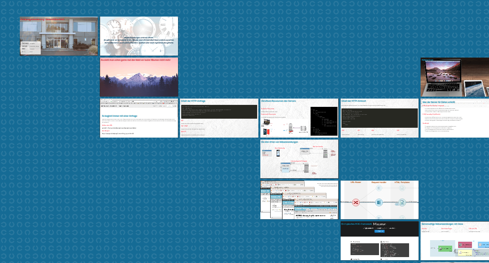

Überblick zur Vorlesung "Webprogrammierung"
===========================================

Kurzbeschreibung
----------------

Diese Folien zeigen einen schnellen Überblick über die wichtigsten Themen der
Vorlesung „Webprogrammierung“ im Studiengang Wirtschaftsinformatik an der
DHBW Karlsruhe. Es werden nur die Themen kurz angesprochen, die im Selbststudium
am Anfang der Vorlesung behandelt werden. Die vertiefenden Inhalte aus dem
Projekt (insb. die Entwicklung von Single Page Apps) sowie Details zu JavaScript,
die beide große Teile der Vorlesung ausmachen, werden hier noch nicht besprochen.

Copyright
---------

Diese Folien sind lizenziert unter
[_Creative Commons Namensnennung 4.0 International_](http://creativecommons.org/licenses/by/4.0/)

© 2017 – 2018 Dennis Schulmeister-Zimolong im Auftrag der DHBW Karlsruhe  

E-Mail: [dhbw@windows3.de](mailto:dhbw@windows3.de)  
Webseite: https://www.wpvs.de

Die Erstellung dieser Unterlagen wurde in den Jahren 2017 und 2018 durch
das Projekt „DigiTransMoBiL – Gestaltungskompetenzen für die Digitale
Transformation durch Modulbausteine mit innovativen Lehrinhalten und
Lehrmethoden” gefördert.
